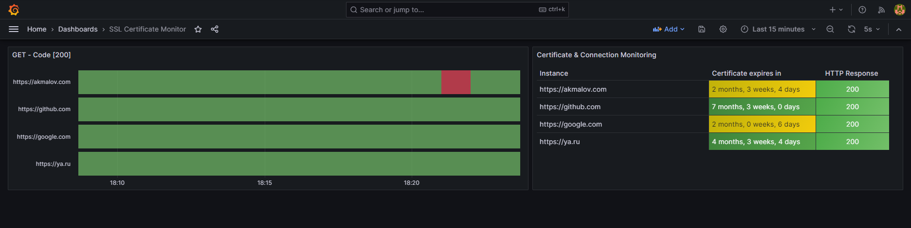
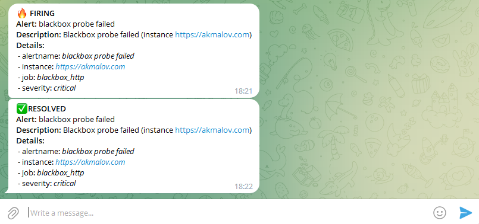

# Simple example monitoring hosts and SSL certificate expiration

If you need very simple monitoring of hosts, it is easier to use another service - [uptime-kuma](https://github.com/louislam/uptime-kuma) 


If your monitoring system already uses Prometheus and Grafana, then you can see how it is implemented here. Welcome




### 📄 Services

* Prometheus
* Blackbox
* Alertmanager
* Grafana

### ⭐ Features

* Monitoring Certificate expired
* Host availability monitoring HTTP(s)
* Grafana dashboard
* Notifications via Telegram 


## Install

used docker-compose 🐳

```bash
git clone 
cd 
```

- Change targets hosts `/prometheus/prometheus.yml`

- Change telegram notifications settings `/alertmanager/config.yml`

- Change permission for Grafana folder:
``` bash
chmod -R 777 data/grafana/
```

Start services
```bash
docker-compose up -d
```

Check services
```bash
docker-compose ps
```


WEB UI:
- Grafana: [YOUR-IP:3000]()
- Prometheus: [YOUR-IP:9090]()
- Blackbox: [YOUR-IP:9115]()
- Alertmanager: [YOUR-IP:9093]()

Telegram alerts:


---

### Alertmanager telegram settings

#### Bot token
Create a bot and get the Bot API key in the channel [BotFather](https://t.me/BotFather)

#### Fetch Chat ID

Start a message with the created bot and write a couple of test messages, then execute the request

```bash
curl https://api.telegram.org/bot<TOKEN>/getUpdates | jq
```


